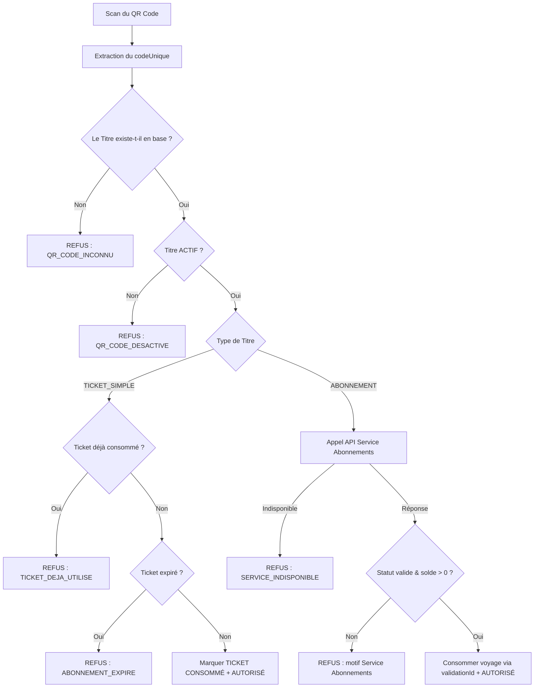

# Service Billetterie — Répartition des tâches, contrat d'API et architecture

> **Ce document est le document de référence pour le Service Billetterie (QR Code, Sécurité, Audit, Thèmes).**
> Il formalise les décisions d'architecture, le contrat d'API, le modèle de données PostgreSQL,
> la gestion de la concurrence, le système d'audit et de journalisation, la gestion des thèmes clair/sombre,
> ainsi que les justifications demandées pour la recherche, le filtrage et les statistiques.

---

## 1. Décisions d'architecture

Le sujet impose que le Service Billetterie soit **indépendant** du Service Utilisateurs et du Service Abonnements.
Il s'agit du troisième microservice du système :

| Point | Décision |
|---|---|
| **Emplacement** | Nouveau dossier `service-billetterie/` à la racine |
| **API** | Node.js + Express, **serveur autonome, port dédié (5070)** |
| **Base de données** | **PostgreSQL** (ORM : Sequelize avec `pg` et `pg-hstore`) — distincte de MongoDB (Utilisateurs) et MySQL (Abonnements) |
| **Données conservées** | Uniquement les identifiants nécessaires (`utilisateurId`, `abonnementId`). **Aucune donnée personnelle dupliquée**, ni stockée dans le QR Code |
| **Authentification** | Même `JWT_SECRET` que les autres services pour valider les jetons émis par le Service Utilisateurs |
| **Contrôle d'accès (RBAC)** | Rôles `Administrateur` et `Agent` : l'agent peut scanner, valider et consulter l'historique ; l'administrateur a accès à la génération, désactivation, audits et statistiques |
| **Communication inter-services** | Exclusivement par requêtes HTTP REST (pas d'accès direct aux bases MongoDB ou MySQL). Appels au Service Utilisateurs (port 5050) et Service Abonnements (port 5065) |
| **Concurrence & Transactions** | Transactions avec verrou pessimiste (`LOCK.UPDATE`) pour éviter les validations simultanées d'un même titre ou dernier voyage |
| **Thème Clair / Sombre** | Intégration sur l'interface React avec persistance dans `localStorage`, sans impacter les règles métier |

### Arborescence cible

```
service-billetterie/
├── package.json
├── .env.example
└── src/
    ├── app.js                   ← application Express exportée (utilisée par supertest)
    ├── server.js                ← démarrage de l'écoute HTTP (port 5070) et synchronisation PostgreSQL
    ├── config/
    │   ├── database.js          ← connexion Sequelize PostgreSQL (support fallback test SQLite/in-memory)
    │   └── logger.js            ← système de journalisation technique (distinct de l'historique)
    ├── models/
    │   ├── TitreTransport.js    ← titres numériques et QR Codes (statut, token, utilisateurId, abonnementId)
    │   ├── Validation.js        ← enregistrement des validations autorisées et refusées
    │   ├── AuditLog.js          ← piste d'audit inviolable des actions sensibles
    │   └── index.js
    ├── middleware/
    │   ├── auth.js              ← vérification JWT + contrôle des rôles (Administrateur / Agent)
    │   ├── audit.js             ← intercepteur d'audit automatique des actions sensibles
    │   └── rateLimiter.js       ← limitation des requêtes pour prévenir les validations abusives
    ├── services/
    │   ├── qrCodeService.js     ← génération de tokens non falsifiables et rendu d'image QR Code
    │   ├── interServices.js     ← appels HTTP vers Service Utilisateurs (5050) et Service Abonnements (5065)
    │   └── validationService.js ← logique de validation, gestion de concurrence et décompte
    ├── controllers/
    │   ├── titreController.js   ← génération, consultation, activation / désactivation
    │   ├── validationController.js ← scan QR code, vérification, enregistrement validation
    │   ├── auditController.js   ← consultation des pistes d'audit (admin)
    │   └── statistiquesController.js ← KPIs billetterie, répartition refus, graphiques
    ├── routes/
    │   ├── titreRoutes.js       ← /api/billetterie/titres
    │   ├── validationRoutes.js  ← /api/billetterie/validations
    │   ├── auditRoutes.js       ← /api/billetterie/audit
    │   └── statistiquesRoutes.js← /api/billetterie/dashboard
    └── utils/
        └── constants.js         ← motifs de refus, types de titres, statuts
tests/
├── setupEnv.js
├── helpers.js
├── unitaires/
│   ├── qrCodeService.test.js
│   ├── validationLogique.test.js
│   └── models.test.js
└── api/
    ├── titres.test.js
    ├── validationsEtScan.test.js
    ├── concurrence.test.js
    ├── audit.test.js
    └── statistiques.test.js
```

---

## 2. Périmètre fonctionnel

| Lot | Contenu | Priorité |
|---|---|---|
| **L1** | Socle technique : PostgreSQL, Sequelize, Express, JWT, Logger, Rate-limiting | 🔴 Socle |
| **L2** | Gestion des QR Codes : génération unique, association client/abonnement, activation/désactivation, rendu image | 🔴 Socle |
| **L3** | Moteur de validation : ticket simple, abonnement limité, abonnement illimité, motifs de refus | 🔴 Socle |
| **L4** | Gestion de la concurrence : protection contre les scans simultanés (verrouillage transactionnel) | 🔴 Socle |
| **L5** | Communication inter-services : vérification client (Utilisateurs) et validité/décompte (Abonnements) | 🟠 Important |
| **L6** | Journalisation technique & Piste d'audit inviolable des actions sensibles | 🟠 Important |
| **L7** | Recherche & Filtrage avancés + Tableau de bord & Statistiques décisionnelles | 🟡 Exigence notée |
| **L8** | Frontend React : Thème clair/sombre, Interface de scan haute visibilité, Gestion des titres, Audits | 🟡 Interface |

---

## 3. Modèle relationnel PostgreSQL

### 3.1 Table `TitreTransport`
- `id` : UUID primaire (ou entier auto-incrémenté)
- `codeUnique` : chaîne unique cryptographiquement aléatoire (UUIDv4 ou token signé HMAC), intégrée au QR Code
- `qrCodeData` : Data URL de l'image QR Code générée (PNG en base64)
- `utilisateurId` : string (identifiant MongoDB du client)
- `typeTitre` : ENUM (`TICKET_SIMPLE`, `LIMITE`, `ILLIMITE`)
- `abonnementId` : integer nullable (identifiant MySQL de l'abonnement si type != TICKET_SIMPLE ou si ticket rattaché)
- `statut` : ENUM (`ACTIF`, `DESACTIVE`, `CONSOMME`, `EXPIRE`) - défaut: `ACTIF`
- `dateCreation` : timestamp
- `dateExpiration` : timestamp nullable
- `consommeLe` : timestamp nullable (renseigné lors de la consommation d'un ticket simple)

### 3.2 Table `Validation`
- `id` : chaîne unique formatée (ex: `VAL-1719230000-xxxx`)
- `titreId` : référence FK vers `TitreTransport.id` (nullable si QR code inconnu)
- `codeScanne` : chaîne scannée
- `utilisateurId` : string nullable (identifiant du client identifié)
- `abonnementId` : integer nullable
- `agentId` : string (identifiant de l'agent effectuant le scan)
- `resultat` : ENUM (`AUTORISE`, `REFUSE`)
- `motifRefus` : ENUM nullable :
  - `QR_CODE_INCONNU`
  - `QR_CODE_DESACTIVE`
  - `TICKET_DEJA_UTILISE`
  - `ABONNEMENT_PAS_ENCORE_VALIDE`
  - `ABONNEMENT_EXPIRE`
  - `ABONNEMENT_SUSPENDU`
  - `ABONNEMENT_RESILIE`
  - `SOLDE_EPUISE`
  - `AUCUN_TITRE_VALIDE`
  - `SERVICE_INDISPONIBLE`
- `dateValidation` : DATE (AAAA-MM-JJ)
- `heureValidation` : TIME (HH:MM:SS)
- `createdAt` : timestamp complet

### 3.3 Table `AuditLog`
- `id` : UUID primaire
- `utilisateurId` : identifiant de l'auteur de l'action
- `role` : `Administrateur` ou `Agent`
- `action` : ENUM (`GENERATION_TITRE`, `DESACTIVATION_TITRE`, `ACTIVATION_TITRE`, `SCAN_VALIDATION`, `VALIDATION_MANUELLE`)
- `ressourceType` : ENUM (`TITRE`, `QR_CODE`, `VALIDATION`)
- `ressourceId` : chaîne (identifiant de la ressource concernée)
- `resultat` : ENUM (`SUCCES`, `ECHEC`)
- `details` : JSON / text (détail contextuel de l'opération)
- `ipAdresse` : string (IP client)
- `createdAt` : timestamp de l'action

---

## 4. Contrat d'API — Service Billetterie

**Base :** `http://localhost:5070/api/billetterie`
**Authentification :** en-tête `Authorization: Bearer <token>` sur toutes les routes protégées.

### 4.1 Titres de transport et QR Codes

| Méthode | Route | Accès | Description |
|---|---|---|---|
| `POST` | `/titres` | Admin | Générer un titre de transport numérique et son QR Code |
| `GET` | `/titres` | Admin, Agent | Liste des titres (avec filtres statut, type, utilisateurId, recherche) |
| `GET` | `/titres/:id` | Admin, Agent | Fiche détail d'un titre et son image QR Code |
| `PATCH` | `/titres/:id/statut` | Admin | Activer ou désactiver un titre de transport |
| `GET` | `/titres/client/:utilisateurId` | Admin, Agent | Titres d'un client donné |

**Exemple de corps pour `POST /titres` :**
```json
{
  "utilisateurId": "6a5b68fc8be4efac6e1a7001",
  "typeTitre": "LIMITE",
  "abonnementId": 42,
  "dateExpiration": "2026-08-18"
}
```

**Exemple de réponse `201 Created` :**
```json
{
  "titre": {
    "id": "c1f72a44-8d45-42df-b214-72fbcf0369a0",
    "codeUnique": "TKT-a94f83bc-42",
    "qrCodeData": "data:image/png;base64,iVBORw0KG...",
    "utilisateurId": "6a5b68fc8be4efac6e1a7001",
    "typeTitre": "LIMITE",
    "abonnementId": 42,
    "statut": "ACTIF",
    "dateCreation": "2026-07-19T10:00:00.000Z",
    "dateExpiration": "2026-08-18"
  }
}
```

### 4.2 Scan et Validation de voyage

| Méthode | Route | Accès | Description |
|---|---|---|---|
| `POST` | `/validations/scan` | Agent, Admin | Scanner et valider un QR Code en temps réel |
| `GET` | `/validations` | Agent, Admin | Historique des validations (filtres date, résultat, motif, agent, client) |
| `GET` | `/validations/:id` | Agent, Admin | Détail d'une validation |

**Corps pour `POST /validations/scan` :**
```json
{
  "code": "TKT-a94f83bc-42"
}
```

**Réponse succès `200 OK` (Voyage autorisé) :**
```json
{
  "autorise": true,
  "message": "Voyage autorisé",
  "validation": {
    "id": "VAL-1719230000-abcd",
    "titreId": "c1f72a44-8d45-42df-b214-72fbcf0369a0",
    "utilisateurId": "6a5b68fc8be4efac6e1a7001",
    "abonnementId": 42,
    "agentId": "6a5b68fc8be4efac6e1a775e",
    "resultat": "AUTORISE",
    "motifRefus": null,
    "dateValidation": "2026-07-19",
    "heureValidation": "14:32:05"
  },
  "titre": {
    "typeTitre": "LIMITE",
    "voyagesRestants": 16
  }
}
```

**Réponse échec `200 OK` (Voyage refusé) :**
*(Code 200 avec `autorise: false` pour un résultat fonctionnel de scan, enregistré en base de validation)*
```json
{
  "autorise": false,
  "message": "Voyage refusé : Solde de voyages épuisé",
  "motifRefus": "SOLDE_EPUISE",
  "validation": {
    "id": "VAL-1719230010-efgh",
    "titreId": "c1f72a44-8d45-42df-b214-72fbcf0369a0",
    "utilisateurId": "6a5b68fc8be4efac6e1a7001",
    "abonnementId": 42,
    "agentId": "6a5b68fc8be4efac6e1a775e",
    "resultat": "REFUSE",
    "motifRefus": "SOLDE_EPUISE",
    "dateValidation": "2026-07-19",
    "heureValidation": "14:32:15"
  }
}
```

### 4.3 Piste d'audit des actions sensibles

| Méthode | Route | Accès | Description |
|---|---|---|---|
| `GET` | `/audit` | Admin | Consultation de la piste d'audit (filtres action, utilisateur, date) |
| `GET` | `/audit/:id` | Admin | Détail d'une entrée d'audit |

### 4.4 Statistiques et Tableau de bord

| Méthode | Route | Accès | Description |
|---|---|---|---|
| `GET` | `/dashboard/stats` | Admin | Indicateurs clés : total titres, validations du jour, taux acceptation/refus, motifs fréquents |

---

## 5. Règles métier de validation et Concurrence

### 5.1 Matrice de décision de validation



### 5.2 Protection contre les validations simultanées

1. **Au niveau du Service Billetterie** :
   - Requête avec verrouillage ligne : `SELECT * FROM "TitreTransport" WHERE id = ... FOR UPDATE` au sein d'une transaction PostgreSQL (`t.LOCK.UPDATE`).
   - Deux requêtes simultanées pour un même ticket simple sont sérialisées : la première valide et passe le statut à `CONSOMME`, la seconde voit `CONSOMME` et refuse immédiatement avec `TICKET_DEJA_UTILISE`.
2. **Au niveau du Service Abonnements** :
   - Le Service Abonnements utilise déjà une transaction avec verrou `LOCK.UPDATE` et une contrainte d'unicité sur `validationId`.
   - Si un abonnement limité ne dispose que d'un seul voyage restant, un seul des deux threads obtient le décompte (`200 OK`). L'autre thread reçoit une réponse `409` ("Solde de voyages épuisé") et le Service Billetterie enregistre le second scan comme `REFUSE` avec motif `SOLDE_EPUISE`.

---

## 6. Système de journalisation (Logs) et Piste d'audit

### 6.1 Distinction stricte
- **Logs techniques** (`config/logger.js`) :
  - Trace les événements techniques : démarrage, arrêt, requêtes HTTP reçues, temps de réponse, communications inter-services (5050 et 5065), erreurs réseau, erreurs 500.
  - Masque les tokens complets, mots de passe et données sensibles.
  - Sortie console + fichiers de log horodatés.
- **Historique métier des validations** (`Validation`) :
  - Tableau accessible aux agents et administrateurs pour le suivi opérationnel des passagers.
- **Piste d'audit inviolable** (`AuditLog`) :
  - Conserve la traçabilité des opérations sensibles (qui, quand, quelle action, quel rôle, IP, résultat).
  - Aucune suppression ou modification n'est permise via l'API. Seule la lecture est offerte aux administrateurs.

---

## 7. Gestion des thèmes Clair et Sombre

- **Implémentation Frontend** :
  - CSS variables pour couleurs de fond, cartes, textes, bordures et statuts.
  - Toggle clair/sombre avec icône Material Symbol (`light_mode` / `dark_mode`) accessible en permanence dans la barre de navigation supérieure.
  - Persistance du choix dans `localStorage` sous la clé `theme` (`light` | `dark`).
  - Détection initiale de la préférence système (`prefers-color-scheme`).
  - Contraste renforcé sur l'écran de scan :
    - Vert éclatant `#10b981` pour `AUTORISÉ` avec texte lisible haute visibilité.
    - Rouge vif `#ef4444` pour `REFUSÉ` avec texte du motif en très grand.

---

## 8. Choix à identifier et justifier (Exigence notée)

### 8.1 Recherche et filtrage

| Fonctionnalité | Cible | Justification métier |
|---|---|---|
| **Filtre par Résultat (Autorisé / Refusé)** | Agents & Admins | Permet à l'agent de voir ses derniers refus pour expliquer un blocage à un usager, et à l'admin de cibler les anomalies de validation |
| **Filtre par Motif de refus** | Admins | Identifie immédiatement les causes dominantes d'incidents (fraude/réutilisation, titres expirés, défaillance réseau) |
| **Recherche par Identifiant Client ou Titre** | Agents & Admins | Retrouve instantanément l'historique de passage d'un client lors d'un contrôle ou d'une réclamation au guichet |
| **Filtre par Agent de contrôle** | Admins | Permet le suivi d'activité des postes de contrôle et des équipes sur le terrain |
| **Filtre temporel (Date / Période)** | Admins | Analyse des flux de validations par créneau horaire ou par journée d'exploitation |

### 8.2 Tableau de bord et statistiques

| Indicateur | Justification métier |
|---|---|
| **Total des validations & Validations du jour** | Mesure le volume global et l'intensité d'affluence quotidienne sur le réseau |
| **Taux d'autorisation vs Taux de refus (%)** | Indicateur de fluidité du réseau et de qualité de service perçue par les voyageurs |
| **Répartition des motifs de refus (Camembert / Barres)** | Permet de distinguer les titres expirés (action commerciale : relance) des tentatives de fraude (tickets réutilisés) et des incidents techniques |
| **Affluence par tranche horaire (Heures de pointe)** | Permet de dimensionner le nombre d'agents de contrôle et d'optimiser la fréquence des transports |
| **Titres actifs vs Titres consommés / désactivés** | Vision d'ensemble sur le volume de titres numériques en circulation |

---

## 9. Plan de tests

- **Tests unitaires (`service-billetterie/tests/unitaires/`)** :
  - Génération de token cryptographique unique et difficile à falsifier
  - Rendu et validité de la chaîne QR Code
  - Logique de décision de validation selon chaque type de titre
  - Validation des schémas de données Sequelize
- **Tests d'API (`service-billetterie/tests/api/`)** :
  - Création de titre et génération de QR Code conforme
  - Activation et désactivation de titre
  - Scan de ticket simple (autorisation premier passage, refus second passage)
  - Scan d'abonnement avec appel simulé au Service Abonnements
  - Concurrence : deux scans simultanés sur le même titre ne permettent qu'une seule validation
  - Journalisation de l'audit pour les actions sensibles
  - Contrôle d'accès RBAC (Agent vs Administrateur vs Non authentifié)
- **Tests Frontend (`frontend/src/`)** :
  - Validation des saisies et des formats
  - Changement et persistance du thème clair/sombre
